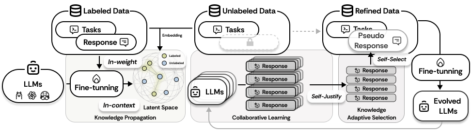

# SemiEvol

This repository contains the official implementation of the paper: [**SemiEvol: Semi-supervised Fine-tuning for LLM Adaptation**](https://arxiv.org/abs/2410.14745).

## TLDR

We have developed **SemiEvol**, which leverages labeled data to enhance inference on unlabeled data, thereby improving the reasoning capabilities of Large Language Models (LLMs). This process is characterized as a bi-level knowledge propagation and selection mechanism.

## Framework



SemiEvol maximizes the utility of labeled data through a bi-level knowledge *propagation-and-selection* framework, while leveraging collaborative learning among multiple LLMs to exploit unlabeled data, unleashing the full data potential. 

## Installation

Install dependencies using the requirements.txt file:

```bash
pip install -r requirements.txt
```

## Dataset and Released Model Weights

- Dataset: https://huggingface.co/datasets/luojunyu/SemiEvol

We have released model weights for two tasks to facilitate testing:

- SemiEvol on MMLU based on Llama-3.1-8B: https://huggingface.co/luojunyu/Llama-3.1-8B-SemiEvol-MMLU
- SemiEvol on MMLU-Pro based on Llama-3.1-8B: https://huggingface.co/luojunyu/Llama-3.1-8B-SemiEvol-MMLUPro

## Usage

- To run the **SemiEvol** process, use:

```python
python pipeline.py --task mmlu --model llama3.1
```
You can adjust parameters such as task, model, and other hyperparameters in `pipeline.py`.

**Please modify the parameters in the code before execution.**

**Note that you need to register your model in `config.py`.**


## BibTex

If our work has been helpful to you, please consider citing it. Your citation serves as encouragement for our research.
```BibTex
@misc{luo2024semievol,
    title={SemiEvol: Semi-supervised Fine-tuning for LLM Adaptation}, 
    author={Junyu Luo and Xiao Luo and Xiusi Chen and Zhiping Xiao and Wei Ju and Ming Zhang},
    year={2024},
    eprint={2410.14745},
    archivePrefix={arXiv},
    primaryClass={cs.CL},
    url={https://arxiv.org/abs/2410.14745}, 
}
```

You can also find the paper at [HuggingFace](https://huggingface.co/papers/2410.14745). 
